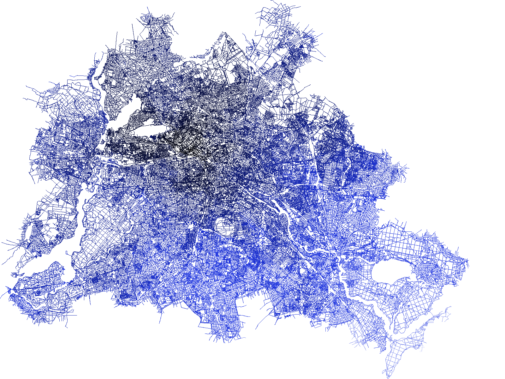

# Shortest Distances Drawing

This project is a simple example that illustrates how to **generate a PNG image** file that shows the **shortest distances** from a random/central node of a road network to all other nodes.
Below you see an example of how this can look like. The darker the color, the closer it is to the starting node of the shortest path tree:


This example also shows how to use the networkx output of [OsmToRoadGraph](../../../).

## How to prepare (create a networkx json file)

If you already have a `*.json` file you can move to `How to run`.

1. Download an OSM XML file (e.g., from here http://download.geofabrik.de/europe/germany.html you can download the [.osm.bz2] file)
1. Unzip the file to obtain the pure xml file (e.g., `bremen-latest.osm`)
1. Run `OsmToRoadGraph` by invoking `python3 run.py -f <FILENAME> -n p -c --networkx` (e.g., `python3 run.py -f data/bremen-latest.osm -n p -c --networkx`)
1. This should have created the `*.json` (e.g., `data/bremen-latest.json`)

## How to run

1. Make sure you have a `*.json` file (if not, see the section above)
1. Install the dependencies: `pip3 install -r requirements.txt`
1. Invoke this script as follows:

```bash
python3 shortest-distances-drawing.py -f <INPUT_FILENAME> -o <OUTPUT_FILENAME>
```

For example:

```bash
python3 shortest-distances-drawing.py -f data/berlin-latest.json -o berlin.png
```

**That's it**: This should an output picture of the shortest distances of road network of the input OSM file.

### Further Customizations

This little script offers some more customization options:

```bash
Options:
  -h, --help            show this help message and exit
  -f IN_FILENAME, --file=IN_FILENAME
                        input networkx JSON file
  -o OUT_FILENAME, --out=OUT_FILENAME
                        output png file
  -c, --center          set this option to compute the shortest distances from
                        an approximate center node [default: random node]
  -m METRIC, --metric=METRIC
                        metric for the shortest path algorithm. Either
                        'length' or 'travel-time' [default: travel-time]
  --width=WIDTH         image width in px [default=1600]
  --height=HEIGHT       image height in px [default=1200]
```

## Make it faster

If you want to run the code faster you can also use `pypy3`:

1. Get pypy3 https://www.pypy.org/index.html
2. Bootstrap pip `pypy3 -m ensurepip`
3. Install dependencies: `pypy3 -m pip install -r requirements.txt`
4. Run it `pypy3 shortest-distances-drawing.py -f <INPUT_FILENAME> -o <OUTPUT_FILENAME>`
