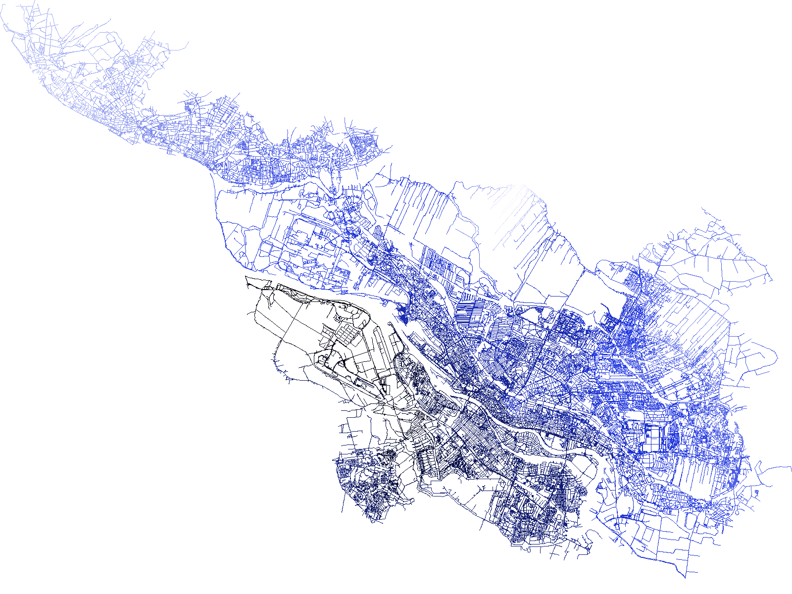

# Shortest Path Tree Visualization

This project is a simple example that illustrates how to **generate a PNG image** file that shows the **shortest path tree** of a road network. Also it is an example on how to load the networkx output of `OSMtoRoadGraph`.

This is an example of how this can look like (the darker the higher the maximum allowed speed is on the street):


## How to prepare (create a networkx json file)

If you already have a `*.json` file you can move to `How to run`.

1. Download an OSM XML file (e.g., from here http://download.geofabrik.de/europe/germany.html you can download the [.osm.bz2] file)
1. Unzip the file to obtain the pure xml file (e.g., `bremen-latest.osm`)
1. Run `OsmToRoadGraph` by invoking `python3 run.py -f <FILENAME> -n p -c --networkx` (e.g., `python3 run.py -f data/bremen-latest.osm -n p -c --networkx`)
1. This should have created the `*.json` (e.g., `data/bremen-latest.json`)

## How to run

1. Make sure you have a `*.json` file (if not, see the section above)
1. Install the dependencies: `pip3 install -r requirements.txt`
1. Invoke this script as follows:

```bash
python3 shortest-path-tree.py -f <INPUT_FILENAME> -o <OUTPUT_FILENAME>
```

For example:
```bash
python3 shortest-path-tree.py -f data/bremen-latest.pycgr -o bremen.png
```

**That's it**: This should an output picture of the shortest path tree of road network of the input OSM file.

### Further Customizations

This little script offers some more customization options:
```bash
Usage: pycgr-to-png.py [options]

Options:
  -h, --help            show this help message and exit
  -f IN_FILENAME, --file=IN_FILENAME
  -o OUT_FILENAME, --out=OUT_FILENAME
  -t TEXT, --text=TEXT  text drawn in lower left corner
  --width=WIDTH         image width in px [default=1600]
  --height=HEIGHT       image height in px [default=1200]
```
